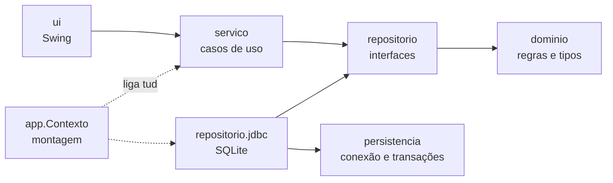

<div align="center">


# VendaFácil

**Sistema de estoque e vendas para pequenos comércios.**

Aplicativo desktop em Java + Swing, com banco SQLite embarcado e distribuído como um único `.jar`.


</div>

---

## Índice

- [Telas](#telas)
- [Funcionalidades](#funcionalidades)
- [Começando](#começando)
- [Onde ficam os dados](#onde-ficam-os-dados)
- [Arquitetura](#arquitetura)
- [Banco de dados](#banco-de-dados)
- [Testes](#testes)
- [Solução de problemas](#solução-de-problemas)
- [Contribuindo](#contribuindo)
- [Licença](#licença)

---

## Telas

| Login | Dashboard |
|:---:|:---:|
|  |  |

| Produtos | Vendas |
|:---:|:---:|
|  |  |

---

## Funcionalidades

**Produtos**
- Cadastro, edição e exclusão com validação em tempo real
- Busca ao vivo enquanto você digita, sem precisar apertar nada
- Ordenação por qualquer coluna
- Nome único, sem diferenciar maiúsculas nem acentos — "Café" e "CAFÉ" são o mesmo produto
- Situação visível por produto: **em estoque** · **estoque baixo** · **esgotado**

**Vendas**
- Registro com baixa automática de estoque e total calculado enquanto você escolhe
- Nunca vende mais do que existe no estoque
- Cancelamento devolve a quantidade ao estoque
- O histórico guarda uma cópia do nome e do preço do momento da venda: editar ou
  excluir o produto depois **não** reescreve o faturamento passado

**Dashboard**
- Receita total, número de vendas, itens em estoque e valor imobilizado
- Alerta dos produtos que precisam de reposição, do mais crítico ao menos
- Últimas movimentações

**Sistema**
- Login com senha protegida por PBKDF2-HMAC-SHA256 (padrão: `admin` / `1234`)
- Banco SQLite com transações, integridade referencial e esquema versionado
- Valores em Real com precisão exata — aceita `10,50`, `10.50`, `1.234,56`, `R$ 5`
- Importação automática dos dados da versão 1.x
- Interface com barra lateral, cartões, tabelas estilizadas e ícones vetoriais

---

## Começando

### Pré-requisitos

| Ferramenta | Versão | Conferir com |
|---|---|---|
| Java JDK | 21 ou superior | `java -version` |
| Maven | 3.9 ou superior | `mvn -v` |

### Executar

```bash
git clone https://github.com/<seu-usuario>/vendafacil-desktop.git
cd vendafacil-desktop
```

**Com o script:**

```bash
./run.sh              # Linux/macOS — compila, testa e abre o app
./run.sh --rapido     # pula os testes
```

```bat
run.bat               :: Windows
run.bat --rapido      :: pula os testes
```

**Com o Maven direto:**

```bash
mvn clean package                  # compila, testa e gera o .jar
java -jar target/vendafacil.jar
```

Entre com **`admin`** / **`1234`**.

### Distribuir

O `mvn package` gera um **jar único** (`target/vendafacil.jar`) com o driver do banco
e todos os recursos embutidos. É o único arquivo necessário para rodar em qualquer
máquina com Java 21 — basta copiar e dar um duplo clique.

No Windows, o [Launch4j](https://launch4j.sourceforge.net/) empacota esse `.jar`
em um `.exe` nativo, se você quiser um instalador.

### Comandos úteis

```bash
mvn test                    # só os testes
mvn clean package -DskipTests   # build rápido, sem testes
mvn dependency:tree         # ver as dependências
```

---

## Onde ficam os dados

Tudo vive em um único banco SQLite:

```
~/.vendafacil/vendafacil.db
```

No Windows, isso é `C:\Users\<você>\.vendafacil\vendafacil.db`.

**Backup:** com o programa fechado, copie esse arquivo (junto com os `-wal` e `-shm`,
se existirem). Restaurar é copiar de volta.

**Trocar o local** — útil para manter os dados em um pendrive ou pasta sincronizada:

```bash
java -Dvendafacil.dados.dir=/caminho/desejado -jar target/vendafacil.jar
```

### Vindo da versão 1.x

Se existir um `~/.vendafacil/dados.txt` da versão antiga, ele é **importado
automaticamente** na primeira abertura. O app mostra quantos produtos e vendas
foram recuperados e renomeia o original para `dados.txt.importado` — o arquivo
nunca é apagado. Linhas corrompidas são puladas em vez de derrubar a importação
inteira.

---

## Arquitetura

O fluxo de dependências aponta sempre para dentro: nenhuma camada conhece quem a chama.



| Camada | Responsabilidade |
|---|---|
| **dominio** | `Produto` e `Venda` são *records* imutáveis que validam no construtor. Não existe objeto inválido em memória; alterar o estoque devolve uma nova instância. Não depende de nada. |
| **repositorio** | Interfaces que descrevem *o que* se pede ao armazenamento. Contagens e somas são declaradas aqui para que o banco as resolva com agregados, em vez de varrer listas. |
| **persistencia** | Conexão SQLite, PRAGMAs, transações aninhadas e tradução de `SQLException` em exceção da aplicação. |
| **servico** | Casos de uso e regras que cruzam entidades. `VendaServico.registrar` baixa o estoque e grava a venda **na mesma transação**. |
| **ui** | Swing puro, sempre na Event Dispatch Thread. Não sabe que existe SQLite. |
| **app** | `Contexto` é a única classe que enxerga todas as camadas: abre o banco, aplica as migrações e liga as peças. |

Erros são separados por natureza: `RegraDeNegocioException` é o que o usuário
digitou de errado e vira mensagem no formulário; `PersistenciaException` é problema
de sistema e vira diálogo de erro.

<details>
<summary><b>Estrutura de pastas</b></summary>

```
vendafacil-desktop/
├── pom.xml                       Build, dependências e empacotamento
├── run.sh / run.bat              Scripts de build e execução
├── src/main/java/com/vendafacil/
│   ├── VendaFacil.java           Entrada: abre o banco, sobe a UI na EDT
│   ├── app/
│   │   └── Contexto.java         Montagem da aplicação
│   ├── config/
│   │   └── Configuracao.java     Diretório de dados
│   ├── dominio/
│   │   ├── Produto.java          Record imutável e sempre válido
│   │   ├── Venda.java            Record com snapshot de nome e preço
│   │   ├── SituacaoEstoque.java  Faixas: esgotado / baixo / normal
│   │   ├── Moeda.java            Real em centavos (long)
│   │   ├── Credencial.java       Login + hash + salt
│   │   └── RegraDeNegocioException.java
│   ├── repositorio/
│   │   ├── ProdutoRepositorio.java
│   │   ├── VendaRepositorio.java
│   │   ├── UsuarioRepositorio.java
│   │   ├── Transacoes.java       Fronteira de transação vista pelos serviços
│   │   └── jdbc/                 Implementações SQLite
│   ├── persistencia/
│   │   ├── BancoDados.java       Conexão, PRAGMAs, transações, mapeamento
│   │   ├── Migrador.java         Esquema versionado
│   │   └── PersistenciaException.java
│   ├── servico/
│   │   ├── ProdutoServico.java
│   │   ├── VendaServico.java
│   │   ├── RelatorioServico.java + Indicadores.java
│   │   ├── AutenticacaoServico.java + Senhas.java
│   │   └── ImportadorLegado.java Migração do arquivo texto 1.x
│   └── ui/
│       ├── TelaLogin.java, TelaPrincipal.java
│       ├── PainelDashboard.java, PainelProdutos.java, PainelVendas.java
│       ├── Tema.java             Design system
│       └── Dialogos.java
├── src/main/resources/
│   ├── logo.png
│   └── db/migracao/V1__esquema_inicial.sql
├── src/test/java/com/vendafacil/ 94 testes JUnit 5
└── docs/                         Screenshots
```

</details>

---

## Banco de dados

Três tabelas, criadas por migração versionada.

| Tabela | Papel | Decisão de projeto |
|---|---|---|
| `produto` | catálogo e estoque | Coluna `nome_busca` (minúsculas) com índice único. O `COLLATE NOCASE` do SQLite só ignora maiúsculas em ASCII, então "Café" e "CAFÉ" passariam como produtos diferentes — a normalização é feita em Java. |
| `venda` | histórico | `produto_id` com `ON DELETE SET NULL`: excluir um produto **não** apaga suas vendas, apenas desfaz o vínculo. Nome e preço já estão congelados na linha. |
| `usuario` | acesso | Guarda hash PBKDF2-HMAC-SHA256, salt e número de iterações — nunca a senha. Cada usuário tem seu próprio salt. |

**Dinheiro** é sempre `INTEGER` de centavos: o SQLite não tem `DECIMAL`, e `REAL`
introduziria erro de arredondamento no faturamento.
**Datas** são texto ISO-8601, que ordena lexicograficamente na mesma ordem cronológica.

O banco roda em `journal_mode = WAL` com `foreign_keys = ON`. O WAL protege contra
desligamento abrupto — um `kill -9` no meio da operação não corrompe o arquivo.

### Adicionar uma migração

1. Crie `src/main/resources/db/migracao/V<n>__descricao.sql`
2. Acrescente o nome ao **fim** da lista em `Migrador.MIGRACOES`

A versão aplicada fica no `PRAGMA user_version` do próprio arquivo, então o banco
carrega consigo a informação de quão atualizado está. Ao subir, só rodam as
migrações que faltam. Abrir um arquivo gerado por uma versão mais nova do programa
é recusado com mensagem clara, em vez de corromper os dados.

> Migrações já publicadas nunca são editadas — bancos existentes não as rodariam de novo.

---

## Testes

```bash
mvn test
```

94 testes JUnit 5 rodando contra um SQLite **em memória** — o banco de verdade, não
dublês. Isso valida constraints, transações e mapeamento junto com as regras de
negócio, e mesmo assim a suíte roda em poucos segundos.

| Área | O que é verificado |
|---|---|
| `Moeda` | Formatos brasileiros, arredondamento, teto de valor, ida e volta |
| `Produto` / `Venda` | Invariantes, imutabilidade, estoque nunca negativo |
| `BancoDados` | Commit, rollback, transações aninhadas, tradução de erros |
| `Migrador` | Criação do esquema, idempotência, recusa de versão futura, constraints |
| `ProdutoServico` | Nome único com acento e caixa, busca, curingas do LIKE, ordenação |
| `VendaServico` | Atomicidade da venda, cancelamento, histórico imune a edição e exclusão |
| `RelatorioServico` | Indicadores consolidados |
| `AutenticacaoServico` | Senha nunca em texto puro, salt por usuário, limpeza da memória |
| `ImportadorLegado` | Migração do arquivo 1.x, linhas corrompidas, execução única |

---

## Solução de problemas

<details>
<summary><b>"Maven não encontrado no PATH"</b></summary>

Instale o [Maven](https://maven.apache.org/download.cgi) e adicione a pasta `bin` ao
`PATH`. Para conferir: `mvn -v`.
</details>

<details>
<summary><b>Erro de versão do Java ao compilar</b></summary>

O projeto exige JDK 21. Rode `java -version` e `mvn -v` — o segundo mostra qual JDK o
Maven está usando, que nem sempre é o mesmo. Se divergirem, aponte a variável
`JAVA_HOME` para o JDK 21.
</details>

<details>
<summary><b>Esqueci a senha</b></summary>

Não há recuperação de senha. Com o programa fechado, apague
`~/.vendafacil/vendafacil.db` para recomeçar do zero com `admin` / `1234` — mas isso
**apaga produtos e vendas junto**. Faça uma cópia do arquivo antes.
</details>

<details>
<summary><b>Quero começar com o banco limpo</b></summary>

Feche o programa e apague a pasta `~/.vendafacil`. Ela é recriada na próxima abertura.
Para testar sem mexer nos dados reais, use um diretório separado:
`java -Dvendafacil.dados.dir=/tmp/teste -jar target/vendafacil.jar`
</details>

<details>
<summary><b>O login demora um instante</b></summary>

É proposital. A senha passa por 120.000 iterações de PBKDF2, o que custa cerca de
100 ms e torna a força bruta cara. A verificação roda fora da thread da interface,
então a janela continua respondendo.
</details>

---

## Contribuindo

```bash
mvn clean package    # precisa passar antes de abrir um PR
```

Convenções do projeto:

- Código, nomes e mensagens em **português** — inclusive nomes de classes e métodos
- Dinheiro sempre em **centavos** (`long`), nunca `double`
- Regra de negócio nova entra no **domínio ou no serviço**, nunca na UI
- Toda mudança de comportamento vem com teste
- Mudança de esquema entra como **nova migração**, sem editar as antigas

---

## Licença

Distribuído sob a licença **MIT**. Veja [`LICENSE`](LICENSE) para os termos.

<div align="center">
<sub>Feito para quem precisa controlar estoque sem depender de internet nem de mensalidade.</sub>
</div>
